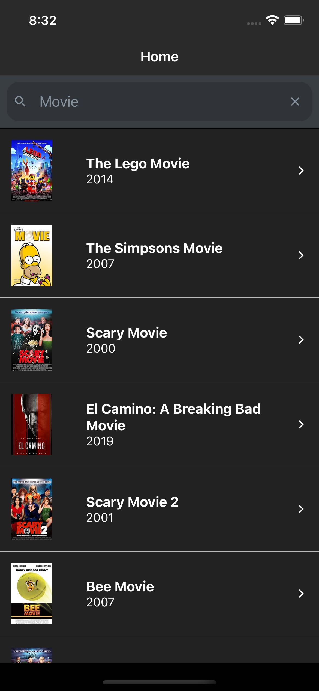
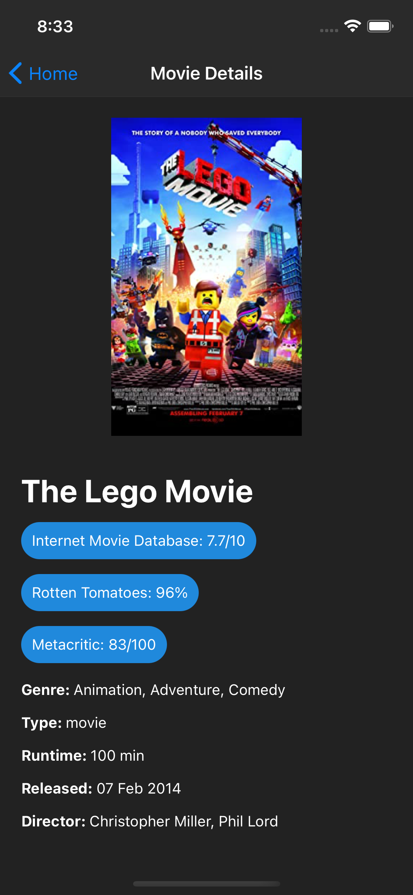

Run `npm install` to install all the necessary node packages.

After that run `npm run android-simulator` and/or `npm run ios-simulator` (if you are using MacOS).

Make sure that you have the android studio and SDK tools installed (https://developer.android.com/studio) and the Android development environment set up (https://reactnative.dev/docs/environment-setup).

If you are runing the ios simulator on a mac you should have Xcode installed.

After the build the app should look like the screenshots below:

